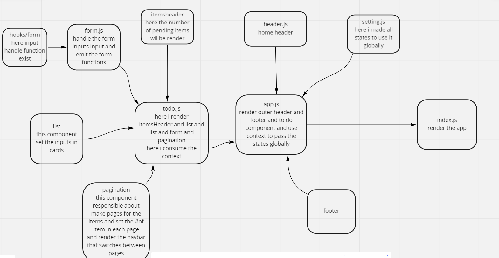

# [netlify link](https://gregarious-cajeta-64cee6.netlify.app/)
### UML 
## phase_1
[phase-1 PR](https://github.com/idreesalmasri/todo-app/pull/4)

 we’re going to perform some refactoring of the To Do application as built by another team. This application mixes application state and user settings at the top level and passes things around. It was a good proof of concept, but we need to make this production ready.

Describe how global state is consumed by the components
we useContext() because him
that allows you to share specific data from all levels of your application and aids in solving prop-drilling.
of during creating provider and put inside it all props i want share it with children and the consumer can use all props when called it 

i created all states inside the context provider and passed all it in the app to todo component and from todo component i passed it to the others list form .

Describe the operation of the hook: useForm()
React Hook Form takes a slightly different approach than other form libraries in the React ecosystem by adopting the use of uncontrolled inputs using ref instead of depending on the state to control the inputs. This approach makes the forms more performant and reduces the number of re-renders.
useForm is a hook that allows for management forms. It has some action methods that create, edit and clone the form. The hook return value comes according to the called action and it can run different logic depending on the action.

## phase-2  
[phase-2 PR](https://github.com/idreesalmasri/todo-app/pull/9)  

in this phase i Provide the users with a form where they can change the values of # of items per page and Whether or not to show completed items.  
also  
saved the user's choices in Local Storage.  
Each time they will re-visit the page, their choices will still be there and can remove any todo.
